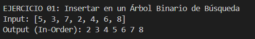
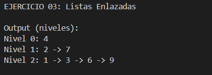
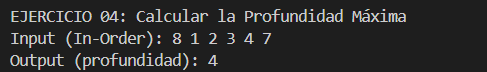

# Estructura de Datos
## Estudiante: Bryan Barros
## Fecha: 10/01/2026

# Estructuras No Lineales – Ejercicios Árboles

Este proyecto presenta la resolución de cuatro ejercicios prácticos enfocados en estructuras de datos de tipo árbol binario, desarrollados como parte del estudio de las estructuras no lineales en Java. Cada ejercicio está organizado en su respectiva carpeta, respetando la convención de paquetes y aplicando buenas prácticas de programación para facilitar su comprensión y mantenimiento.

---


## Explicación para el estudiante

```
src/
│
├── Materia/
│
├── Ejercicio_01_insert/
├── Ejercicio_02_invert/
├── Ejercicio_03_listLeves/
└── Ejercicio_04_depth/
```

---

## Descripción de Ejercicios

### Ejercicio 01: Insertar en un Árbol Binario de Búsqueda (BST)

Carpeta: `Ejercicio_01_insert`
Permite insertar valores enteros en un Árbol Binario de Búsqueda (BST), respetando el orden y las reglas propias de esta estructura.

La solución utiliza un método recursivo que recorre el árbol desde la raíz hasta encontrar la posición adecuada para el nuevo valor.  
Si el nodo actual es `null`, se crea un nuevo nodo.  
Las comparaciones determinan si el valor se inserta en el subárbol izquierdo o derecho, manteniendo las propiedades del BST.

#### Captura:

---


### Ejercicio 02: Invertir un Árbol Binario

📂 Carpeta: `Ejercicio_02_invert`

Invierte un árbol binario intercambiando los subárboles izquierdo y derecho de cada nodo.
El método recorre el árbol de forma recursiva desde la raíz.  
En cada nodo, primero se procesan los subárboles y luego se intercambian, logrando la inversión completa del árbol.  
La recursión finaliza cuando se alcanza un nodo `null`.

#### Captura:


---

### Ejercicio 03: Listar Niveles en Listas Enlazadas

📂 Carpeta: `Ejercicio_03_listLeves`
Obtiene y organiza los nodos de un árbol binario por niveles, agrupando los nodos que se encuentran a la misma profundidad.

La solución utiliza un recorrido por niveles (BFS) apoyado en una cola (`Queue`).  
El proceso inicia agregando la raíz a la cola y, mientras esta no esté vacía, se procesa cada nivel por separado.  
En cada iteración se determina cuántos nodos pertenecen al nivel actual, se almacenan en una lista y se agregan sus hijos a la cola para el siguiente nivel.  
Finalmente, cada nivel se guarda en una lista general que representa la estructura del árbol por niveles.

#### Captura:


---

### Ejercicio 04: Calcular la Profundidad Máxima

Carpeta: `Ejercicio_04_depth`
Calcula la profundidad máxima de un árbol binario, es decir, la longitud del camino más largo desde la raíz hasta una hoja.

La solución utiliza un enfoque recursivo que recorre el árbol desde la raíz.  
Si el nodo actual es `null`, se retorna cero, indicando que no hay profundidad.  
En cada llamada recursiva se calcula la profundidad del subárbol izquierdo y derecho, y se selecciona el valor mayor, sumando uno para contar el nivel del nodo actual.  
De esta forma, se obtiene la profundidad máxima total del árbol.

#### Captura:


---

## Rúbrica de Calificación

| **Criterio**       | **Descripción**                                                                       | **Puntaje** |
| ------------------ | ------------------------------------------------------------------------------------- | ----------- |
| **Informe**        | No hay informe                                                                        | 0 pts       |
|                    | Informe parcial **sin explicación** de cada método                                    | 1 pt        |
|                    | Informe parcial **con explicación** de cada método                                    | 2 pts       |
|                    | Informe completo                                                                      | 3 pts       |
| **Funcionamiento** | No implementado                                                                       | 0 pts       |
|                    | Implementado parcialmente: <br>• Ejercicio 1 y 4 → 2 pts<br>• Ejercicio 2 y 3 → 4 pts | 2–4 pts     |
|                    | Código funcional pero **no pasa todas las pruebas**                                   | 6 pts       |
|                    | Código funcional y **pasa todas las pruebas correctamente**                           | 7 pts       |


## Contribuir

Para contribuir a este proyecto, por favor crea un fork y envía una solicitud de extracción, o simplemente abre un issue con tus comentarios y sugerencias.

## Autores

- [PABLO TORRES] - Desarrollo inicial
- [BRYAN BARROS] - Desarrollo final
